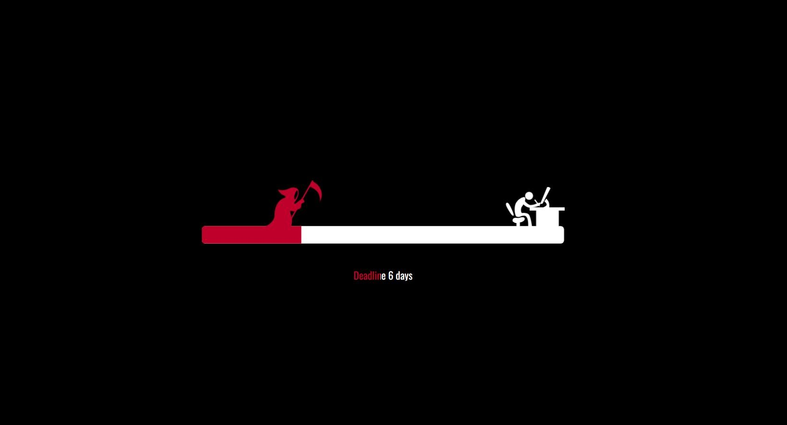

<div align="center">

# ⏳ Deadline Animation

### When time is running out, every second counts.

An interactive SVG-based animation that creatively visualizes the pressure of an approaching deadline through motion, progress effects, and animated storytelling.

<br>



<br><br>


<br>

<a href="https://github.com/IbrahimBello-666/Deadline-Animation">
  
</a>

</div>

---

## 📌 About The Project

**Deadline Animation** is a creative front-end project that turns the concept of an approaching deadline into a visual experience.

The project uses animated SVG elements, CSS keyframes, JavaScript, and jQuery to create a scene that represents the pressure of racing against time.

As the deadline approaches, the animation brings together movement, progress indicators, character actions, and visual effects to tell a simple story about completing work before time runs out.

---

## ✨ Features

- ⏳ Animated deadline progress bar
- 🎭 SVG character animations
- 🏃 Smooth movement effects
- ✍️ Writing animation
- 🔥 Dynamic visual effects
- 🔄 Continuous animation loop
- 🎨 Creative SVG-based design
- 📱 Lightweight browser experience
- ⚡ No heavy frameworks required

---

## 🛠️ Built With

This project was built using:

- HTML5
- CSS3
- JavaScript
- jQuery
- SVG

---

## 📂 Project Structure

```text
Deadline-Animation/
│
├── assets/
│   └── preview.jpg       # Project preview image
│
├── index.html            # Main application structure
├── style.css             # Styling and animations
├── script.js             # Animation logic
├── README.md             # Project documentation
└── LICENSE               # GPL-3.0 License